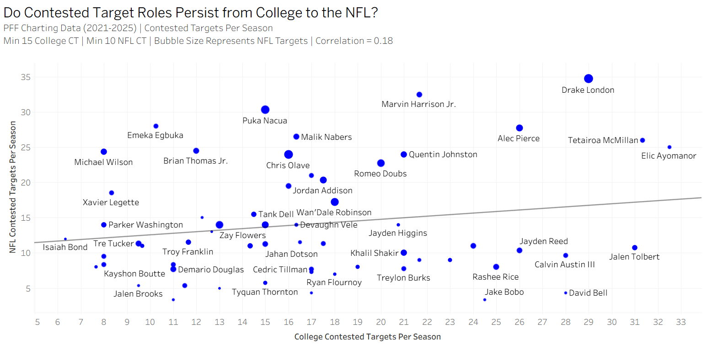

# WR Contested Catch Translation Study

## Overview

This project explores whether contested catch ability translates from college football to the NFL using PFF charting data and player-level receiving metrics.

The study was motivated by a common scouting belief that receivers who consistently win in contested situations in college should continue to demonstrate similar success at the NFL level.

Using player-level data from college and NFL receiving datasets, this project examines both contested catch efficiency and contested target usage to determine whether either metric demonstrates persistence across levels.

## Research Questions

### 1. Does contested catch efficiency translate from college football to the NFL?

### 2. Do receivers who are heavily used in contested situations in college continue to occupy similar roles in the NFL?

### 3. Are contested catch metrics meaningful standalone projection tools without additional contextual variables?

---

## Data

Data was sourced from PFF charting data and includes:

### College WR Data

* 2021–2024 seasons

### NFL WR Data

* 2022–2025 seasons

### Metrics Used

* Contested Targets (CT)
* Contested Receptions
* Contested Catch Rate (CCR)
* Receiving Production
* Season-Level Receiving Statistics
* Player-Level Aggregated Statistics

---

## Methodology

### Data Pipeline

The project was built entirely in Python using:

* pandas
* matplotlib

### Workflow

1. Raw college and NFL WR data exports
2. Data cleaning and normalization
3. Player matching using Player ID
4. Construction of player-level comparison datasets
5. Aggregation of contested catch metrics
6. Scatter plot analysis and correlation testing
7. Exploratory comparison of contested catch efficiency and contested target usage

### Analysis 1: Contested Catch Rate Translation

For each player, contested catch rate was calculated as:

CCR = Contested Receptions / Contested Targets

College and NFL contested catch rates were compared to evaluate whether contested catch efficiency persists across levels.

### Analysis 2: Contested Target Role Translation

To account for differences in NFL career length and available seasons, contested target usage was normalized on a per-season basis.

College Contested Targets Per Season were compared against NFL Contested Targets Per Season to evaluate whether contested-catch roles persist across levels.

---

## Key Findings

### Finding 1: Contested Catch Efficiency Shows Virtually No Relationship

College contested catch rate showed almost no relationship to NFL contested catch rate.

**Correlation: -0.03**

Receivers who posted strong contested catch efficiency in college did not consistently demonstrate similar contested catch efficiency in the NFL.

This suggests contested catch efficiency alone may not be a strongly translatable standalone trait when projecting wide receiver performance across levels.

.png)

---

### Finding 2: Contested Target Roles Show Weak Persistence

After normalizing for career length on a per-season basis, contested target usage showed a weak positive relationship between college and NFL performance.

**Correlation: 0.18**

Receivers who were frequently used in contested situations in college were somewhat more likely to continue occupying similar roles in the NFL.

While the relationship is modest, it was noticeably stronger than the relationship observed for contested catch efficiency.

---

## Interpretation

One potential takeaway is that NFL teams may continue to deploy certain receivers in contested-catch roles, even though success within those situations does not appear to translate as consistently.

This suggests that contested-catch role and contested-catch efficiency may represent two different evaluation concepts:

* Role persistence may exist.
* Efficiency persistence appears limited.

Additionally, contested catch production is likely influenced by contextual factors beyond the receiver's ball skills, including:

* Offensive structure
* Quarterback tendencies
* Route profile
* Receiver role
* Defensive competition
* Separation ability

As a result, contested catch metrics may reflect surrounding circumstances as much as individual receiver skill.

---

## Limitations

This project is exploratory in nature and should not be interpreted as a definitive player evaluation model.

Several important variables were intentionally excluded:

* Separation metrics
* Height and weight
* Draft capital
* Alignment data
* Route tree information
* Quarterback aggressiveness
* Target quality
* Target share
* Coverage tendencies

Additional limitations include:

* Contested catch charting is dependent on PFF definitions and methodology.
* Contested catch opportunities are relatively rare events, creating small-sample volatility.
* The final filtered sample contained approximately 50–70 qualifying receivers depending on thresholds applied.
* Contested target usage was normalized on a per-season basis rather than a per-game basis.
* NFL seasons are longer than college seasons, which may influence usage comparisons.

---

## Future Work

Potential future expansions include:

* Contested target volume per game
* Games-played normalization
* Receiving-snap normalization
* Athletic testing data
* Draft capital integration
* Receiver archetype comparisons
* Separation metrics
* Role-based translation analysis
* Predictive clustering models

A future version of this project will investigate whether the relationship between college and NFL contested target usage changes when normalized on a per-game basis.

---

## Repository Structure

data/

outputs/

scripts/

charts/

---

## Author

**Thomas Germano**

MS Sports Management Candidate — Columbia University

Football Operations & Analytics
